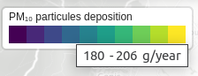

# maplibregl-scale-legend

A MapLibre control to switch the map background layer.

## Installation:

```bash
npm install https://github.com/EPFL-ENAC/maplibregl-scale-legend.git --save
```

## Usage:

```ts
import { ScaleLegendControl } from "maplibregl-scale-legend";
import { Map } from "maplibre-gl";

import "maplibregl-scale-legend/styles.css";

const map = new Map();
map.addControl(new ScaleLegendControl());
```

## Options:

If you want to supply your own list of scale legends, pass them in the constructor.

```ts
import { ScaleLegendControl } from 'maplibregl-scale-legend',
import type { ScaleDefinition } from 'maplibregl-scale-legend',

const scales: ScaleDefinition[] = [
    // ...
];

const scalesControl = new ScaleLegendControl(scales);
map.addControl(scalesControl);
```

If you want to show a specific scale, use the `schowScale()` function.

```ts
// show a specific scale
scalesControl.showScale(scaleId);

// hide all scales
scalesControl.showScale();
```

## Screenshots


